<div align="center">

# सारthi · Sarthi

> **सारथी**, the charioteer who steers the rider.
> A voice and photo life coach that runs your whole life from one capture surface.


**OpenAI Build Week · Track: Apps for your life · Built with Codex + GPT-5.6**

[**Live demo**](https://sarthi-gray.vercel.app/) · [**Watch the video**](https://www.youtube.com/watch?v=DtNvdCOvIY4) · [**GitHub**](https://github.com/SawhneySatvik/Sarthi)

</div>

---

Most of us track our lives in pieces. A food app, a budgeting app, a habit tracker, some notes for whatever we are trying to learn. None of them talk to each other, and logging the same day in four different places is enough friction that most people quietly give up.

Sarthi starts from the opposite idea. You say one ordinary sentence out loud:

> _"spent ₹340 on lunch, 2 rotis and dal, drank a bottle, 90 min of system design, woke at 5:10"_

and it files that into four parts of your life at once: **Health, Money, Habits, and Skills.** The numbers you clearly stated get saved on their own. Anything the app had to guess, like the calories in that lunch, shows up as a card you confirm first, so nothing estimated is ever written behind your back. Point your camera at a plate or a receipt and vision reads it the same way. A coach sits on top of all of it. It reacts to what you log, gives you a short brief in the morning, reflects with you each week, and when it wants to change your plan it shows the change in the open, before and after with a reason, and you can undo it.

One idea holds it together: **one capture pipeline, four typed stores, four screens that each look at your life a little differently.** Adding a new area of life later is just a new schema and a new screen, because the hard part only gets built once.

---

## 🖼️ A look at it

_Bone theme, the calm default. It is a mobile-first app you can install to your home screen._

| | |
|:--:|:--:|
| **Today** is where your day lives | **Capture** turns a sentence into confirmable entries |
| 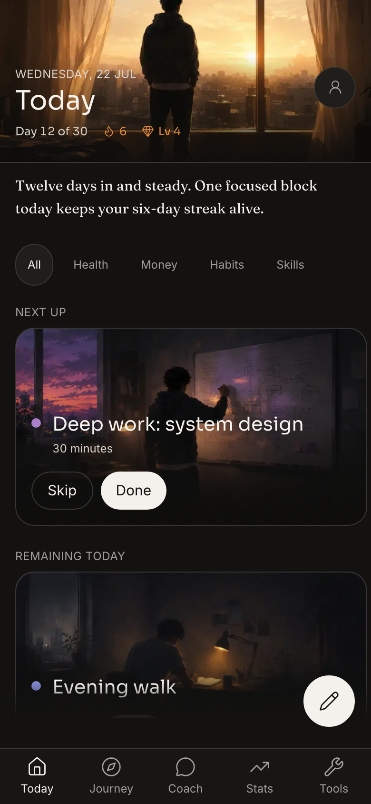 | 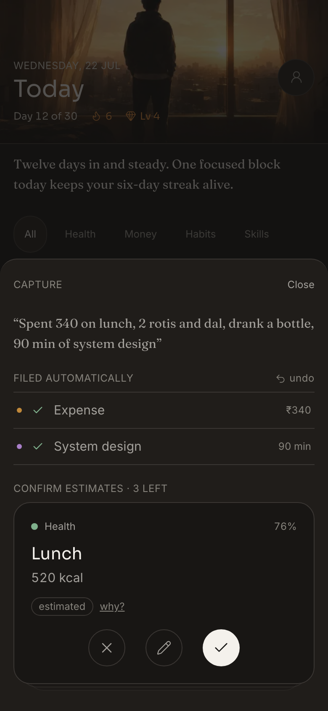 |
| **The coach** shows its plan changes in the open | **Stats** is the progress you actually earned |
| 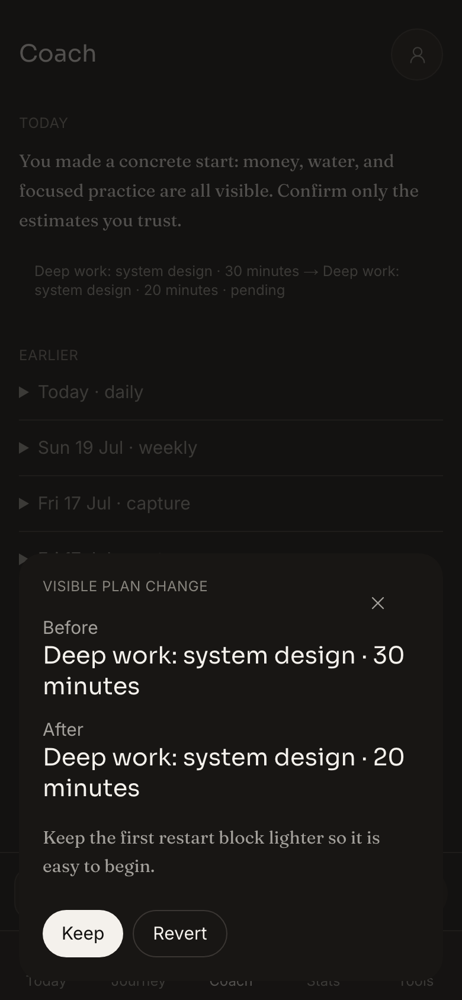 | 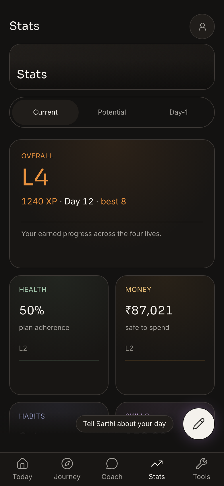 |
| **A domain lens**, here your Health rings | **Journey**, your days written down |
| 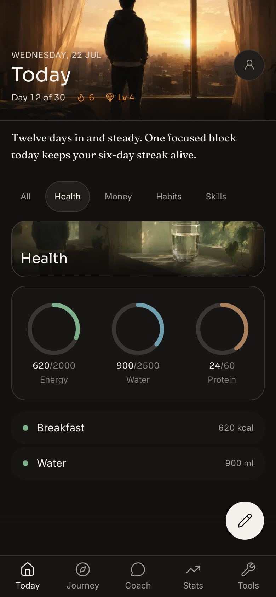 | 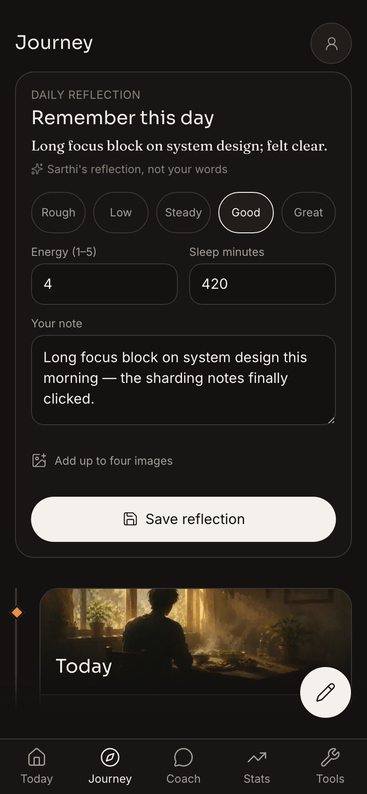 |
| **Tools** for focus, meditation and more | **Onboarding** builds your plan with you |
| 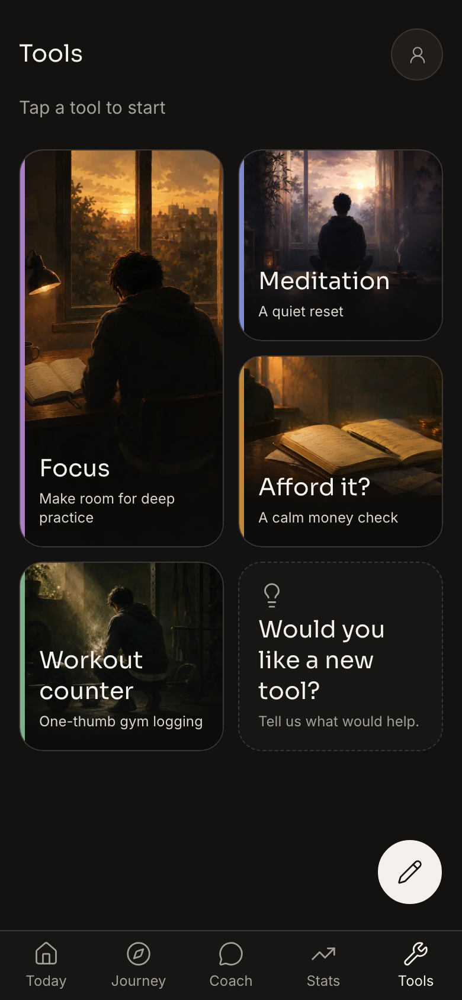 | 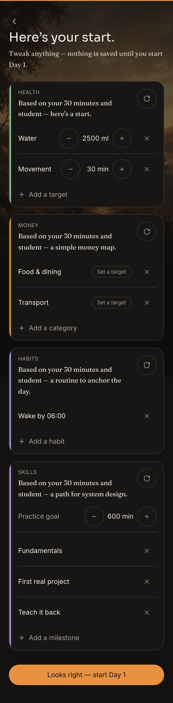 |

<details>
<summary><b>☀️ The same screens in light mode</b></summary>

| | | | |
|:--:|:--:|:--:|:--:|
| 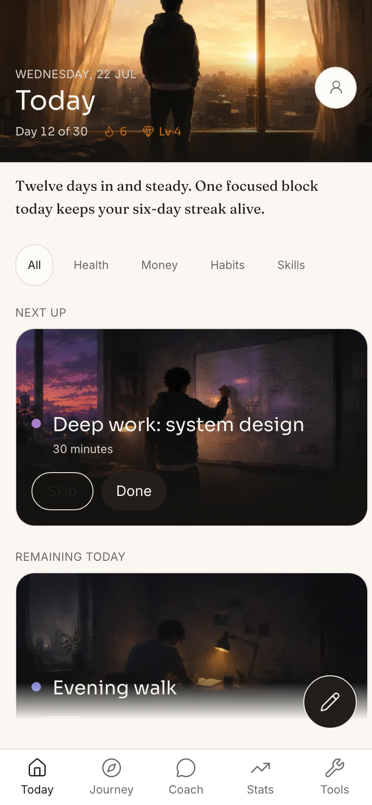 | 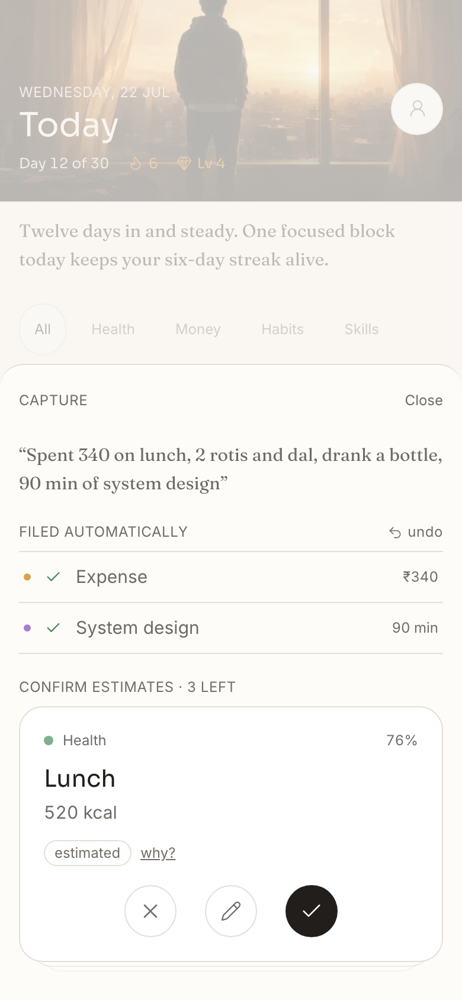 | 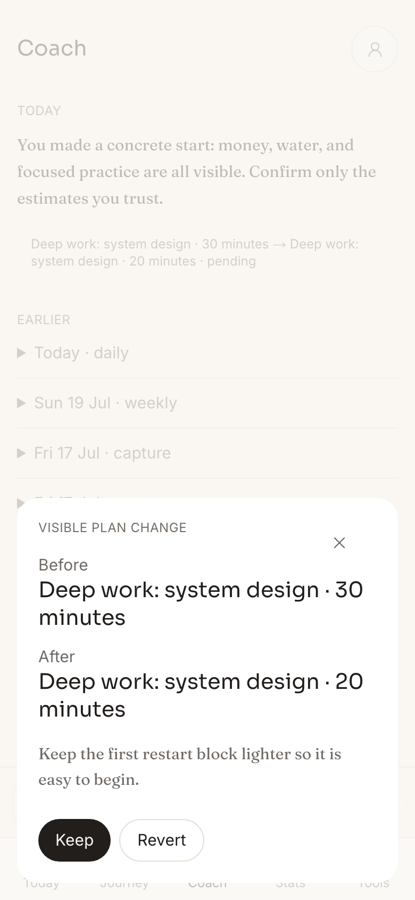 | 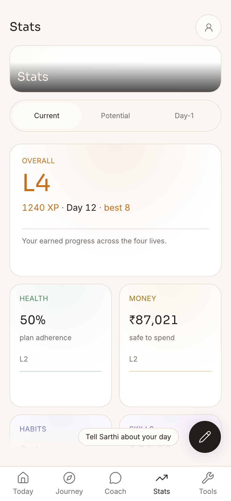 |
| 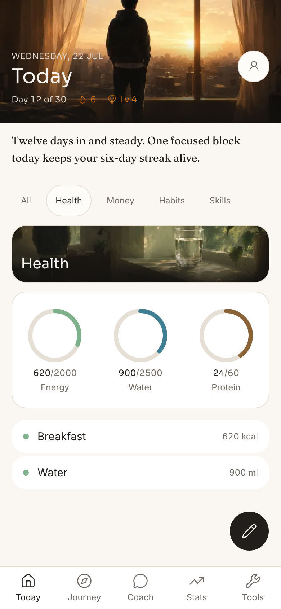 | 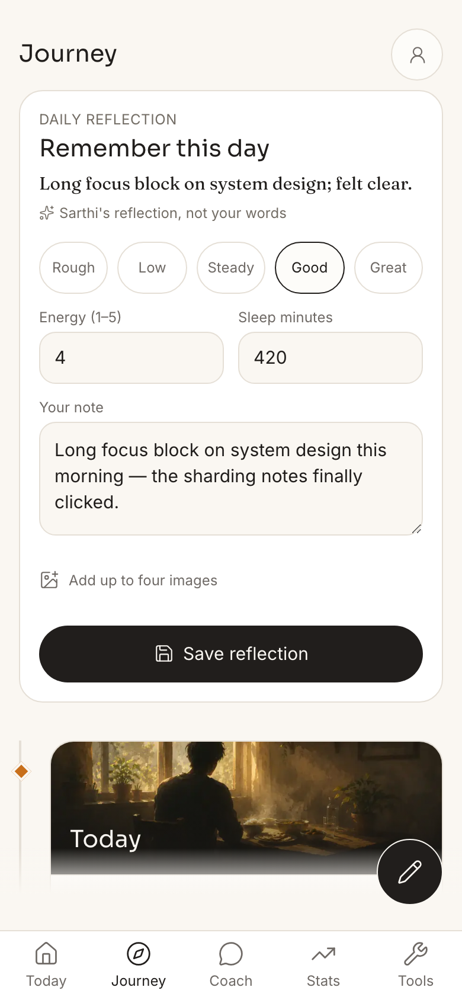 | 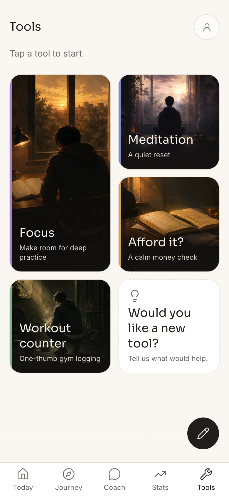 | 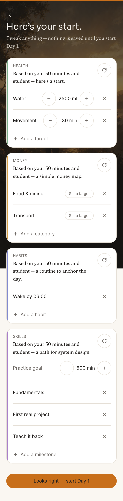 |

</details>

---

## What it actually does

Plan-and-track apps hand you four separate trackers and a plan that never moves. Sarthi does the reverse. It collapses the four trackers into one sentence, and it re-plans around the day you actually had.

```
                   ┌──────────────┐   routed by     ┌─────────────┐
  one spoken   ──► │  the parser  │ ─ confidence ─► │ Health      │ ─┐
  sentence, or     │  (typed, so  │                 ├─────────────┤  │   four
  one photo        │  it can't    │                 │ Money       │  ├─► screens that
                   │  drift)      │                 ├─────────────┤  │   each read
                   └──────────────┘                 │ Habits      │  │   your life
                          │                         ├─────────────┤  │   differently
              clearly said ─► saved on its own      │ Skills      │ ─┘
              only estimated ─► a card you confirm
```

Build that pipeline once, and a new area of life is just a schema and a screen.

## The four parts of your life

<table>
<tr>
<td width="25%" align="center"><br/><b>Health</b><br/><sub>a daily arc</sub></td>
<td width="25%" align="center"><br/><b>Money</b><br/><sub>an arc plus a ledger</sub></td>
<td width="25%" align="center"><br/><b>Habits</b><br/><sub>a daily arc</sub></td>
<td width="25%" align="center"><br/><b>Skills</b><br/><sub>hours toward mastery</sub></td>
</tr>
<tr>
<td><sub>estimates calories, macros and effort from a line of text or a photo, and adapts your workouts</sub></td>
<td><sub>parses receipts, sorts spend, spots recurring bills, and flags where money leaks</sub></td>
<td><sub>ramps targets gently, stacks routines, and can complete one habit from another</sub></td>
<td><sub>builds a roadmap for anything you want to learn, logs the hours, and checkpoints you</sub></td>
</tr>
</table>

Health, Money and Habits run as day-based arcs. Skills run as hour-based mastery tracks.

## Why the estimates are safe (the part I cared about most)

The single worst thing an app like this can do is quietly save a wrong number. So it cannot.

- **Only what you clearly said gets written on its own.** Everything the model estimated becomes a card you accept, edit, or throw away, and you can flip it over to see why it guessed what it did.
- **Every write can be undone**, and each one lands in its own typed table, so nothing vague is floating around in the data.
- **Money stays in whole paise**, quantities in whole units. No floats, ever.
- **When it is unsure, it asks** instead of inventing an entry.

## The coach

The coach is not a chat window bolted onto the side. It only ever sees your real data, through tools that read your four stores, so it cannot make up a number it has not seen. It keeps a short running memory and a longer one that holds the things that matter to you, like a savings goal or an hours target, and it brings those up across conversations. When it wants to change your plan, it writes the change as a proposal you can Keep or Revert, so your plan never moves without you. Online it is genuinely helpful. Offline it says so honestly, and the rest of the app keeps working.

---

## Try it

**Live:** [`https://sarthi-gray.vercel.app/`](https://sarthi-gray.vercel.app/)

- **Try the demo** drops you straight into a seeded 12-day life. A full Today, four lenses with real data, and the coach mid-conversation. No sign-up, no credentials.
- **Start fresh** gives you your own private space and walks you through onboarding from an empty slate.

Nothing in the demo is ever locked behind a paywall.

## Bring your own key

By default the live site runs on a deterministic fake, so the whole thing works with no keys. To see real model calls, open **Settings, then "Your AI key"** and paste your own Gemini or OpenAI key. It stays in your browser, it is never sent to our servers, and it is scrubbed from any error. One key powers everything: parsing, vision, and the coach.

## Run it yourself (no keys needed)

**You need** Node 22 or newer and pnpm 11.9.

```bash
pnpm install

# Seed the 12-day demo into a local SQLite file. This resets the db and
# applies migrations itself, so there is no separate migrate step.
SEED_STATE=populated pnpm db:seed:dev

pnpm dev   # http://localhost:3000
```

No `.env` and no API keys are required. Everything defaults to the keyless fake stack and a single local user. To try real AI locally, use the same "Your AI key" panel.

## What is inside the demo

The seeded 12-day life spans all four areas: logged meals and water feeding the Health rings, a month of money with recurring salary, rent and a subscription, habits with streaks and a heatmap, a System Design track past its hundred-hour mark, and a coach with a daily note, a weekly reflection, remembered goals, and one plan change you can revert.

---

## How it is built

The runtime is deliberately model neutral. The app talks to Gemini, GPT-5.6, or Claude through one gateway, and any of them can be swapped with a single line of config. Development runs on a free tier and a deterministic fake, so iterating costs nothing and the whole capture loop runs with no keys at all. Under that sits Next.js and TypeScript, a token-only design system, and Drizzle over SQLite in development and Supabase Postgres in production, all behind a repository layer so the business logic never touches the database driver.

**How it was actually written is part of the story.** Sarthi was coded end to end with **Codex, running on GPT-5.6.** I did not type it out file by file. I set up a small crew of agents on top of Codex and let them run: one planned each piece down to the decisions before any code existed, one wrote it, and a third reviewed the diff and checked it against rules that were never allowed to break, like "nothing estimated is written silently" and "the whole thing runs with no keys." Plans were signed off before building started. A fair amount of it happened overnight. I would leave the harness running and come back to a branch full of reviewed, tested commits.

**The art is generated too.** Every painterly scene in the app, the sunrises on Today, the tool cards, the domain screens, was made with **GPT Image** and then compressed to WebP so the app stays light. More than forty of them ship in the build.

**Where Codex made the difference.** The full running log of where Codex accelerated the build, and where the key decisions were made, lives in [`docs/product/CHANGELOG.md`](docs/product/CHANGELOG.md). Codex `/feedback` session where the core functionality was built: `019f6cc9-957e-7ae3-8ffa-c54fc699eb44`.

> **Two layers, kept separate on purpose.** The models the app *calls at runtime* are provider neutral and default to the fake stack. That is a different thing from the tools used to *build* the app. This project leans hard on the second: Codex and GPT-5.6 did the building.

---

## Where it is going

The web app you are looking at is mobile-first and installs as a PWA. That was the fastest way to get here, but it is not the finish line.

- **A proper native mobile app.** The core logic already lives in a shared, framework-free package, so a native shell can use it directly. This is a real next step, not a rewrite, and it is the direction I most want to take Sarthi.
- **A first-class desktop layout.** It was built phone-first, and making the wide screens as considered as the small ones is next in line.
- **A coach that reaches out** at the right moment instead of waiting to be opened, and that compounds what it learns about you week over week.
- **More areas of life**, which the architecture makes cheap, since each new one is a schema and a screen.

The direction is simple. The same one-sentence capture, wherever you are, and native where it counts.

---

<div align="center">
<sub>Sarthi collapses four trackers into one sentence, and re-plans around the day you actually had.</sub>
</div>
